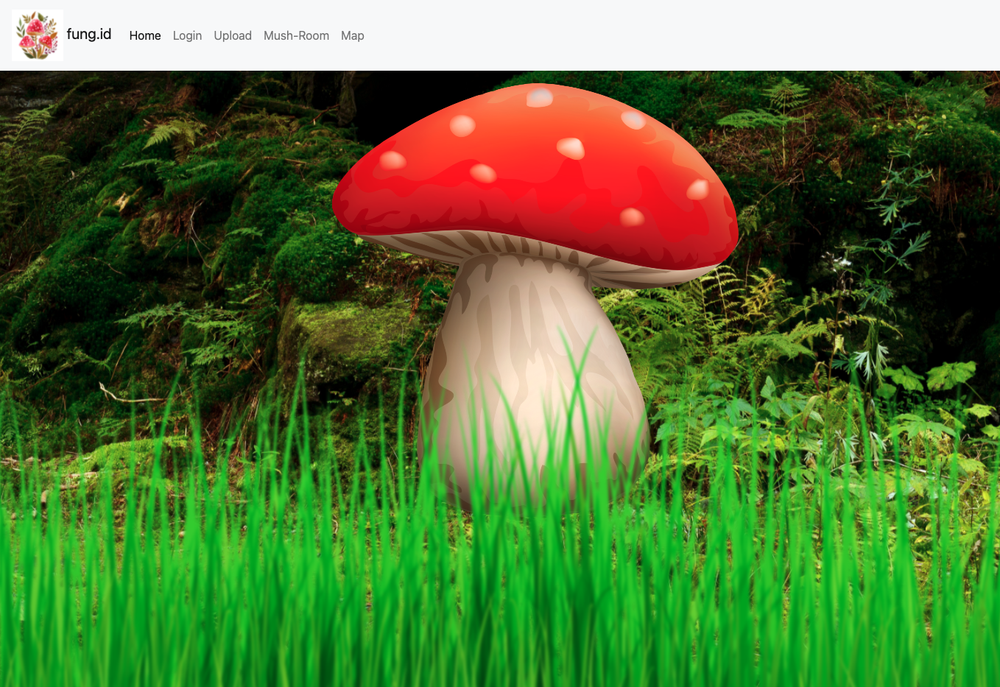

# [fung-id: a fun fungus finder's guide](https://fung-id-final.herokuapp.com/)
## Description
This application allows users to add, annotate, view, and utilize photographs of their foraging finds. Upon uploading an image to Cloudinary's hosting service, a data object is returned from which the image's url, coordinates, and created date are returned and then inserted into our SQL database. A thumbnail of the image is immediately appended to the gallery view which, when clicked, expands to an individual view where the image, notes, and location data can be referenced for future foraging forays. 
## Installation
1. ```npm install ```
    ### Dev Dependenies:
    ``express``
    ```sequelize```
    ```bcrypt```
    ```cloudinary```
    ```handlebars```
    ```mysql2```
    ```dotenv```
2. include .env file for database and Cloudinary keys. 
3. initialize SQL database. see db/schema.sql.
4. ```node server.js``` to spin up the server. 
5. ```seeds/index.js``` to seed.
## Using the Deployed Application
1. Head to the main homepage [HERE](https://fung-id-final.herokuapp.com/)
2. 
3. Visit the [login](https://fung-id-final.herokuapp.com/login) page to log in or sign up.
4. Navigate to the upload page. 
5. Click the ```upload files``` button and select an image to upload to the gallery. 
6. Enter a title and description for the image after the upload finishes. 
7. Click ```submit```. 
8. Navigate to [Mush-room](https://fung-id-final.herokuapp.com/mush-room) to view a thumbnail gallery of your colleciton of images. 
9. Click any thumbnail to view a full-size image, notes entered on the upload step, and a map with geolocation data so you can always remember where you found this mushroom. 
10. Click ```logout``` to end your session. 
## Credits
Image functionality made possible by [Cloudinary](https://cloudinary.com/documentation/image_upload_api_reference)'s image hosting and upload widget resources. 
Map functionality was achieved through the combined resources of [Leaflet](https://leafletjs.com/), [OpenStreetMap](https://www.openstreetmap.org/#map=5/38.007/-95.844), and [Mapbox](https://www.mapbox.com/). 
## Contributions
This project was a group endeavor willed into begrudging functionality by
[Amanda Hamilton](https://github.com/polysnacktyl), [Matt Ward](https://github.com/mattrward1030), [Som Safavi](https://github.com/somisalami12), and me,  [Peter MoDavis](https://github.com/PeterMoDavis). We are very proud of ourselves. 
For questions or contributions contact pmodavis.webdev@gmail.com.
## Future Development
Directions for future development: 
- pulling in weather data,
- fleshing out full CRUD functionality,
- more thorough use of location data for driving directions and sharing locations,
- static db information about types of mushrooms to look out for based on region and growing season, 
- weather-based reminders to check on specific locations when current weather conditions match historic conditions they've been catalogued under before, 
- and last but certainly not least, including CYA warnings about never ever consuming mushrooms you cannot identify with certainty. 
